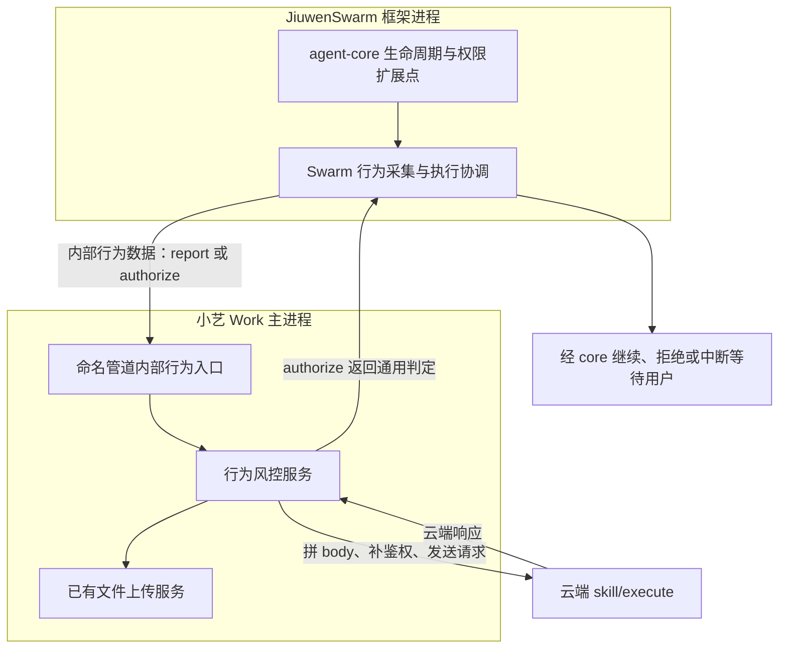
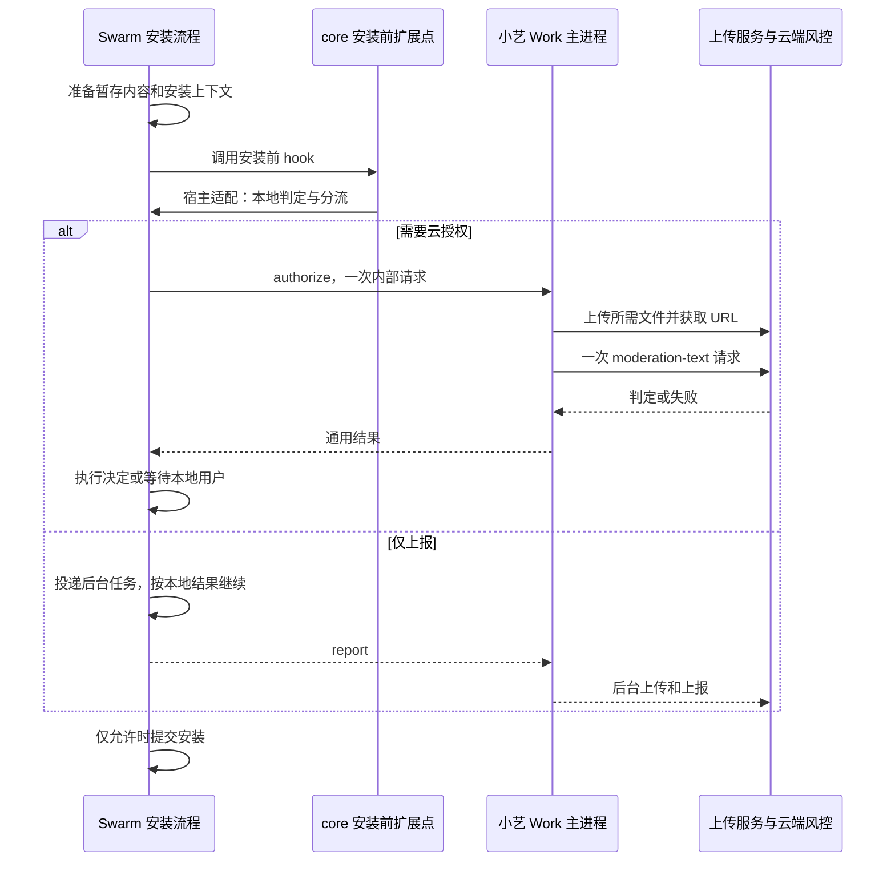

# 小艺 Work 行为上报与云端授权分层方案 v2

> 最新方案：agent-core 提供通用 hook 与权限机制；JiuwenSwarm 基于这些扩展点采集行为、协调执行与用户授权；小艺 Work（claw_desktop）负责云端请求体拼装、鉴权、文件上传及响应解析。
>
> 本文是后续编码与验收参考，不代表功能已经实现。skill 安装的云端 `textSource` 固定使用 **`toolSkill`**。

## 1. 文档关系与代码基线

更新日期：2026-09-21。

本文保留[原需求文档](C:/Users/newcs/data/code/jiuwenclaw-xiaoyao/jiuwenclaw/docs/zh/2026-09-21-小艺Work行为上报与云端授权需求.md)已确认的业务规则，**替代其中关于三层职责、云端 body 构造、云响应解析、文件上传执行位置的实现建议**。后续开发以本文的分层方案为准；原文保留为需求沟通记录和原始数据格式参考。

| 仓库 | 核对分支 | 核对提交 |
| --- | --- | --- |
| JiuwenSwarm | `xiaoyi_0.2.4.beta3` | `0f9f79817cbeeb4ff103470ce9e00cb8fa9d030d` |
| agent-core | `br_0.1.16.post2.hotfix` | `cffa8b40aae8825b05eb9c04e4c49ebc015b4dea` |
| claw_desktop | `jiuwenswarm` | `47f4366517f496a7cdd97d00177c0a1aaac20093` |

JiuwenSwarm 当前 `uv.lock` 指向上述 agent-core 提交。本次依据实际源码核对，未进行真实云端、管道及用户界面的端到端联调。

术语约定：

- **已确认规则**：需求沟通确定的业务约束。
- **源码现状**：上述提交中已有的行为。
- **建议新增**：待实现设计；接口名、模块名和内部字段可在开发时按仓库规范调整。
- **遗留项**：尚未确认的接口口径，不能视作已确定要求。

## 2. 本期范围与不变的业务规则

### 2.1 三个接入点

| 接入点 | 时机 | 建议内部事件名 | 小艺 Work 映射的云端 `textSource` |
| --- | --- | --- | --- |
| ④ | Agent 工具执行前 | `tool.before` | `toolInput` |
| ⑥ | Agent 工具执行后 | `tool.after` | `toolOutput` |
| ⑦ | skill 安装前 | `skill.before_install` | `toolSkill` |

内部事件名是设计建议，不是云端新增字段。`toolSkill` 是已确认的云端值。

本期不扩展 query/answer 原有风控、自动更新、内置技能初始化或团队专项审批。三个接入点是本期范围边界，不代表自动覆盖所有绕过这些接入点的文件写入行为。

### 2.2 本地权限和请求分流

增加表示“无法判定”的真实权限枚举，建议名称为 `UNDETERMINED`。

- 没有匹配到专门规则时，进入 `UNDETERMINED`。
- `defaults["*"]: allow` 属于兜底，不属于专门规则命中。
- 明确工具规则、参数规则和有效既有用户授权等仍按原优先级处理。
- 明确 `ASK` 属于本地已覆盖，直接请求用户授权。
- 新状态不能覆盖已明确的 `DENY` 或 `ASK`，也不能破坏文件、网络等防护结果的合并。

| 本地结果 / 场景 | 发往桌面端的模式 | 是否等待云端 | 后续行为 |
| --- | --- | --- | --- |
| `ALLOW` | `report` | 否 | 按本地规则允许 |
| `DENY` | `report` | 否 | 按本地规则拒绝 |
| `ASK` | `report` | 否 | 直接请求本地用户授权 |
| `UNDETERMINED`，云授权开启 | `authorize` | 是 | 根据外部判定继续、拒绝或转交互 |
| `UNDETERMINED`，云授权关闭 | `report` | 否 | 转本地 `ASK`，不能再次套用 default allow |
| 工具执行后 | `report` | 否 | 继续后续流程 |

`report / authorize` 是建议的内部通信模式，不自动加入云端 body。

**同一接入点的一次行为只发起一次逻辑云请求。** `authorize` 的请求同时完成行为上报和云端判定，不能先发 `report` 再重复请求授权。工具输入、工具输出及安装前检查属于不同事件，分别上报。

### 2.3 配置开关

开关继续放在 JiuwenSwarm 的 `config.yaml`，由 Swarm 决定是否等待外部授权。建议结构：

```yaml
xiaoyi_work_security:
  cloud_authorization:
    enabled: false
    timeout_ms: 3000
```

字段路径和 `3000` 毫秒为实现建议，不是接口方确认的 SLA。授权等待预算应覆盖本次必要的管道通信、文件准备/上传和云判定，不能每一层各等待一个完整预算而无限叠加。

关闭云授权仍保留异步上报和本地用户授权，不复用 `permissions.enabled` 关闭整个权限系统。对未接入本需求的其他 core 宿主保留既有兼容行为。

## 3. 三层职责与部署位置

agent-core 是被 JiuwenSwarm 使用的 Python 库，不是新增的独立服务。core 的 hook 和 Swarm 的适配逻辑运行在框架进程中；小艺 Work 主进程运行在 Electron/Node.js 侧，两个进程经命名管道通信。

| 工作 | agent-core | JiuwenSwarm | 小艺 Work / claw_desktop |
| --- | --- | --- | --- |
| 工具前后生命周期 hook | 提供已有机制 | 注册采集/适配实现 | 接收行为数据 |
| 本地权限引擎及无法判定枚举 | 提供通用能力 | 配置、注入宿主实现 | 不重复评估本地规则 |
| 权限判定完成后的宿主扩展 | 补充通用契约与调用位置 | 实现上报/授权分流 | 处理外部判定请求 |
| skill 安装前 hook | 定义通用契约与调用机制 | 在真实安装生效前触发 | 处理安装信息 |
| 工具名、参数、结果、技能来源 | 提供运行时上下文 | 采集、快照、关联 | 转为云端字段 |
| 事件去重、中断与恢复 | 提供基础机制 | 协调执行和状态 | 去重接收及进行中的云请求 |
| 云端 body 与字段映射 | 不承担 | 不拼最终云端 body | 统一承担 |
| 云端地址、能力 ID、鉴权 | 不承担 | 仅使用本机通信配置 | 统一承担 |
| 文件上传及云端 URL | 不承担业务上传 | 提供稳定的文件引用 | 优先复用现有上传服务 |
| 云端响应解析与业务语义转换 | 不认识云端格式 | 消费通用结果 | 解析并转换 |
| 用户确认、澄清和恢复执行 | 提供通用中断能力 | 关联当前行为并执行 | 展示交互、回传答案 |



小艺 Work 中纯类型、字段转换和客户端可放在 `src/core/`；依赖凭据、应用配置、文件服务及 Electron 生命周期的组装放在 `src/main/`。这里的 `claw_desktop/src/core/` 是桌面仓库内部目录，与 Python agent-core 是不同概念。

## 4. 已有 hook 核对与复用结论

### 4.1 工具执行前后：直接复用

core 的 `AgentCallbackEvent` 已有 `BEFORE_TOOL_CALL / AFTER_TOOL_CALL / ON_TOOL_EXCEPTION`；`AbilityManager._railed_execute_single_tool_call()` 已通过 `@rail(...)` 实际触发工具前后事件。

`ToolCallInputs` 提供 `tool_call / tool_name / tool_args / tool_result / tool_msg`，能够承担行为采集。`BaseSecurityRail` 已提供工具前后方法以及允许、拒绝、中断等基础处理。

建议实现：

- 工具前复用现有回调准备原始事件快照，由权限结果扩展点统一决定发送模式，不能提前发送一次。
- 工具后复用现有回调投递结果事件，始终走 `report`。
- 纯采集/上报优先使用观察式回调；使用 `BaseSecurityRail` 时不覆盖已有中断决定，不用上报结果改写工具结果。
- 采集和授权须对应实际工具参数；工具参数经过其他 Rail 改写时，明确采集顺序和判定有效性。

当前 after 回调在部分失败或权限中断时也可能触发，取消和重试又有不同处理。需要结合异常、执行状态和结果判断，不把“进入 after 回调”当成成功执行，也不重复记录中断恢复前的合成输出。

### 4.2 权限宿主扩展：复用确认能力，补判定后的入口

当前 `ToolPermissionHost` 的相关扩展点：

| 已有扩展点 | 当前时机与语义 | 本期用途 |
| --- | --- | --- |
| `permission_scene_hook` | 通用本地判定之前介入，可提前允许或拒绝 | 保留原场景，不拿来重新实现整套本地判定 |
| `request_permission_confirmation` | 对 ASK 请求确认 | 复用明确 ASK 及外部不可用后的用户授权 |
| `get_permissions_snapshot` 等 | 配置快照、记住授权、路径解析 | 继续沿用 |

当前 `PermissionInterruptRail` 在本地 `ALLOW / DENY` 后直接返回，只有需要确认的分支进入宿主确认。因此，只修改确认回调会漏掉允许和拒绝行为的上报。

**建议新增 `on_permission_evaluated`（拟名）**，位于本地有效结果已经形成、执行对应分支之前。其最小契约应包含：

1. 输入：行为上下文、关联 ID、本地结果、匹配来源，以及必要的恢复状态。
2. 明确 `ALLOW / DENY / ASK`：允许宿主投递观察事件，保留本地决定；观察失败不能反转决定。
3. `UNDETERMINED`：允许宿主返回通用处理结果；没有可用外部判定时转本地确认。
4. 确认、中断、拒绝与恢复执行仍由既有权限机制处理。
5. 有效会话授权、场景提前返回等路径也需要统一归类，避免这些路径绕过行为记录；中断恢复不重复发送已处理事件。

这是新增通用能力的设计，不是当前已有 API。core 不调用小艺接口，也不解析 `securityResult` 或 `retCode`。具体回调返回类型在编码时与现有决策类型对齐。

### 4.3 skill 安装前：新增通用契约，由安装方触发

源码现状：

- core 的 `core/single_agent/skills/SkillManager` 主要负责注册、读取和查询技能，不能把其注册动作直接等同于 Swarm 的安装。
- core 另有技能演进包安装代码，但它不是当前 Swarm 多种安装来源共用的安装前检查入口。
- Swarm 的 SkillManager 中存在目录复制、覆盖、导入及状态登记等真实安装动作。
- `set_skillnet_install_complete_hook()` 在成功落盘后才调用，用于刷新/重载，不能承担安装前授权。

**建议在 core 定义 `before_skill_install`（拟名）及通用 `SkillInstallContext`**，提供明确的异步调用与决策返回契约，由 Swarm 的实际安装流程使用。

安装上下文建议包含安装操作 ID、技能标识、来源、暂存文件引用、目标位置，以及可选的会话和工具调用关联。不能要求所有调用者必须构造一个正在运行的 Agent；有关联会话时接入既有中断/恢复，没有时显式处理当前入口支持的交互。

```text
准备/下载到暂存区
    → 构造安装上下文
    → 调用 core 定义的安装前扩展点
    → Swarm 实施本地权限与 report/authorize 分流
    → 允许后提交安装：复制/覆盖、登记、刷新
```

不能只增加事件枚举但不增加真实调用位置。也不需要为了增加 hook，把所有下载器和安装业务搬进 core。

## 5. JiuwenSwarm 实现范围

建议增加统一的行为协调适配层，负责以下基本能力：

1. 通过 core hook 获取数据，形成稳定的行为事件快照。
2. 使用既有权限引擎，不在业务适配层再实现一套规则匹配。
3. 根据本地结果和云授权开关选择 `report / authorize`。
4. 通过命名管道传内部事件，不传完整小艺云端 payload。
5. 接收通用结果，通过现有权限/中断能力继续、拒绝或请求用户输入。
6. 维护同一事件的发送和恢复状态，关联输入、输出及安装操作。

Swarm 仍需提供桌面端无法自行还原的事实：原始工具调用、实际输出、调用 ID、来源、会话/运行标识和必要对话内容。这些是框架数据，不等于 Swarm 负责云端格式。

工具前的采集 Rail 和权限结果 hook 共用一次行为状态，指定唯一的发送责任方。旧 `CsplSentinelRail` 已有等待式扫描和失败放行行为，目标场景需协调其挂载关系，不能与新实现重复请求或冲突拦截。

安装流程还需关注：

- 现有部分实现将下载、解析和复制放在同一同步函数或后台线程中，需要拆出“准备”和“提交”，使 hook 能在提交前等待。
- 等待授权前不能先删除旧技能目录。
- `install_skill` 等路径存在捕获普通异常并返回失败对象的处理；新增交互控制信号不能被误吞成普通安装失败。
- 仅在 `before_tool_call` 中识别 `install_skill` 不足以完成接入点⑦：此时可能尚无待安装文件。
- ④和⑦是独立事件，但必须关联同一个安装动作；对⑦使用的权限上下文和有效用户授权范围应明确，不凭空生成永久授权。

## 6. 命名管道与内部通信协议建议

### 6.1 复用传输，新增行为处理入口

建议复用现有 `np://claw-skill` 通道和本机调用令牌，在桌面端增加内部行为路由，例如：

```http
POST /internal/security/behavior
Authorization: Bearer <local-pipe-token>
Content-Type: application/json
```

该路径是**拟新增的本机接口**，当前尚不存在，也不是云端路径。需要在本机鉴权后进入行为处理服务，不交给现有云路径白名单和原样转发分支直接发送。

现有 `SkillApiProxy` 收集 body 后执行 `proxyReq.end(body)`，不会替 Swarm 拼 body。新增内部入口应委托专门服务，保持其他 skill 请求原有的透明代理语义。

框架只持有本机管道令牌；云端业务凭据及其刷新仍在主进程。`CLAW_SKILL_TOKEN` 不转发为云端凭据。

### 6.2 内部行为数据

以下字段是建议内部契约，开发时可精简或调整；不能把它当成已确认云端接口定义。

```json
{
  "version": 1,
  "eventId": "evt-example-before-1",
  "event": "tool.before",
  "mode": "authorize",
  "sessionId": "session-example",
  "runId": "run-example",
  "turnId": "turn-example",
  "toolCallId": "call-example-1",
  "localPermission": "undetermined",
  "tool": {
    "name": "write_file",
    "arguments": {
      "path": "notes.txt",
      "content": "hello"
    }
  }
}
```

| 事件 | 在公共关联信息之外传递的事实 |
| --- | --- |
| `tool.before` | 原始调用、工具名、参数、可用的调用 index/type，以及本地判定来源 |
| `tool.after` | 同一工具调用关联、实际结果、执行状态和必要异常信息 |
| `skill.before_install` | 安装 ID、技能标识、来源、稳定的暂存文件引用、可用的原始安装调用信息 |

保留原始参数表示，避免对象转换后丢失不可解析的原始输入。输出应有明确的可序列化转换策略。文件引用须是桌面进程可读取的有效引用；不能仅凭存在一个 Python 路径就假设 Electron 能读取。

最终 `seqNo` 与现有对话轮次关联。桌面端依据当前事件的稳定会话/轮次标识或随事件提供的实际轮次值完成映射，不能让后台任务执行时去读取已经推进到下一轮的全局计数器。

### 6.3 report 与 authorize 的返回语义

`report`：Swarm 将本机投递放入受管理的后台任务；桌面接收后可返回入队确认，再异步准备文件和请求云端。下面的确认只表示本机受理，不表示云端收到或授权通过。

```json
{
  "eventId": "evt-example-after-1",
  "status": "queued"
}
```

`authorize`：同一次内部请求等待主进程完成必要的上传和云判定，再返回通用结果，例如：

```json
{
  "eventId": "evt-example-before-1",
  "decision": "allow",
  "reason": "external_policy_allowed"
}
```

建议通用结果包含 `allow / deny / clarify / unavailable`，必要时携带提示或结构化问题。它与本地权限枚举是两个不同概念：`unavailable` 表示外部调用没有得到有效判定，不能转换为允许。

`clarify` 可使用通用交互请求附带“交互不可用时如何处理”的策略；本期小艺 CLARIFY 的放行降级由桌面适配器给出，core 不硬编码小艺的特例。实际类型优先与已有中断协议对齐。

### 6.4 关联、超时和生命周期

- 同一逻辑事件使用稳定 `eventId`；输入、输出、安装前事件拥有不同 ID，通过工具调用/安装 ID 关联。
- Swarm 的中断恢复和桌面的请求处理都要识别已受理或已完成事件，避免双重上报和双重授权。
- `report` 的网络失败只记录上报结果，不改变本地权限决定。
- `authorize` 超时或管道失败转本地 ASK；迟到云响应不得在用户拒绝后重新允许该行为。
- 用户取消任务时停止恢复执行；与云端失败、交互不支持分别处理。
- 使用受管理的后台任务或有界队列，明确异常处理、资源释放和退出行为。不承诺未实现的断电不丢或严格 exactly-once。

## 7. 小艺 Work 的业务实现

### 7.1 复用基础，增加行为风控适配

建议增加独立的行为风控服务（例如 `BehaviorRiskControlService`，拟名），供内部管道入口调用。可复用的现有能力：

| 当前能力 | 复用方式 | 需要调整之处 |
| --- | --- | --- |
| `buildExtra()` | 设备、用户、包名、时间等上下文 | 按实际运行上下文组装 |
| `buildModerateBody()` | 公共字段拼装方式 | 当前以文本为主；增加行为 body 构造器或兼容对象型 questionText |
| `moderateText()` 及底层请求 | HTTP、鉴权相关调用方式和响应解析 | 使用 moderation-text，保留外部失败状态 |
| `RiskControlService` 的主进程组装 | 凭据、应用版本、代理等依赖注入 | 不直接复用 query/answer 的失败放行策略 |
| `uploadFileToOsms()` | 文件上传并取得云端 URL | 在描述口径明确后选择上传对象 |

行为服务负责云端语义；Swarm 只消费通用结果，core 不依赖任何小艺云端字段。

### 7.2 云端接口及字段归属

```http
POST /celia-claw/v1/rest-api/skill/execute
x-skill-id: moderation-text
Content-Type: application/json
```

`skill/execute` 是云端能力路由，`moderation-text` 是所调用的风控能力，不局限于本地 skill 安装。

| 云端字段 | 小艺 Work 的处理规则 |
| --- | --- |
| `businessId` | 使用 `WINPC_XIAOYI_WORK` |
| `action` | 三个接入点均使用 `tool`，只出现一次 |
| `textSource` | 根据内部事件映射为 `toolInput / toolOutput / toolSkill` |
| `questionText` | 工具输入/输出为 JSON 字符串；安装为对象，沿原样例类型 |
| `questionText.function.arguments` | 涉及原始工具调用时按原样例序列化为 JSON 字符串 |
| `questionText.file` | 安装请求中放在 questionText 对象内，由桌面服务构造 |
| `answerText` | 原需求三个样例均为空字符串 |
| `sessionID / seqNo` | 从实际会话和轮次关联信息映射，保留正确大小写 |
| `extra` | 由桌面上下文构造 JSON 字符串，不是嵌套对象 |
| `isXiaoyiAPP` | 使用修正后的字段名；布尔值按实际产品上下文确定 |
| `textStatus` | 本期三个接入点为 `complete` |
| `language / countryCode / enableExperiencePlan` | 来自实际宿主/会话上下文 |
| `dialogueContext` | 从真实对话上下文构造；不编造安装入口不存在的历史 |
| `isFinalEqualsLastText` | 按工具输出样例及现有适用方式提供 |

主进程负责填充鉴权头和业务头，Swarm 不再选择云端 skill ID、云端地址或最终 body 字段。云字段变化原则上收敛在桌面适配器；只有新增了框架原本未提供的事实，才扩展内部事件协议。

### 7.3 云端返回与本期特殊策略

复用现有返回结构，区分调用成功与授权成功：

```json
{
  "retCode": "0",
  "retMsg": "success",
  "data": {
    "securityResult": "ACCEPT"
  }
}
```

| 云端情况 | 桌面适配结果 / 策略 | Swarm 动作 |
| --- | --- | --- |
| `ACCEPT` | 本次允许 | 继续当前行为，不自动持久化扩大授权 |
| `REJECT` | 拒绝及提示 | 拒绝当前行为 |
| `CLARIFY`，有可用题干且具备完整交互条件 | 通用澄清请求 | 通过现有 ask_user 关联、展示和恢复 |
| `CLARIFY`，无可用题干或交互不能走通 | 按需求规定允许本次，记录降级原因 | 依据明确降级结果继续 |
| 超时、网络/鉴权/业务错误、无有效决策 | `unavailable`，不能伪装成 ACCEPT | 请求本地用户授权 |

上表只用于 `authorize`。`report` 返回的云端判定仅用于记录，不反转本地结果。

当前 query/answer 服务把接口错误和 CLARIFY 按放行处理。新增行为服务必须区分这两者，不能复制原服务的整体兜底语义。HTTP 200 或成功 retCode 但没有有效决策，也不能当成行为允许。

当前 ask_user 需要非空题干，桌面也会过滤空问题；未发现现成的 CLARIFY 到完整交互流程的适配。`remind / lastingRemind` 是提示文案，不能自动认定为可回答的澄清问题。用户补充任意文字不等于授权，取消也不属于“交互不支持”。无法关联问题、答案和后续行为判断的分支，不能声称已走通。

此前提到的 `clarification=0/1/2/3` 尚无已接通的字段适配，本期不据此擅自实现永久授权或新增云端复审协议。无题干场景已有放行规则，不阻塞主体开发。

## 8. 文件上传与安装时序

### 8.1 上传执行位置调整

原需求提出参考 Swarm 中 `send_file_to_user` 相关上传机制。当前桌面端也已有 `uploadFileToOsms(filePath, deps)`，完成同类流程：

```text
prepare → 上传文件内容 → completeAndQuery → fileDetailInfo.url
```

在新分工下，优先直接复用桌面现有服务。Swarm 准备稳定的安装内容及引用，桌面负责选择需上传的内容、调用上传服务，并将 URL 和文件描述放入最终云端 body。

本机 `/file-api/download?...` 地址不能直接作为云端可访问 URL。也不调用整个 `send_file_to_user` 工具，避免额外向用户发送文件卡片或写入投递历史。

### 8.2 两种等待方式



`authorize` 的必要上传失败导致无法完成云判定，进入本地用户授权。`report` 的文件上传在后台执行，不能让纯上报路径等待上传完成。

Swarm 负责待安装内容的稳定性，桌面负责上传任务对该内容的持有/读取。需明确引用交接与清理时机，避免安装清理暂存区后，后台上报找不到文件。不能审核一份内容、最终安装另一份内容。

### 8.3 安装入口边界

本期在指定安装前接入点触发，不能简单以“Agent 调用了一个安装工具”代替文件准备后的检查。桌面现有部分安装直接写技能目录，可能绕过 Swarm；仅在 Swarm 接 hook 不会自动覆盖这些路径。保持既定范围，在实现和验收中明确实际经过的入口，不将旁路宣称为已覆盖。

## 9. 各仓库落地清单与源码索引

### 9.1 agent-core

| 源码位置 | 现状 / 拟改动 |
| --- | --- |
| [rail/base.py:206](C:/Users/newcs/data/code/agent-core-br_0.1.16.post2.hotfix/openjiuwen/core/single_agent/rail/base.py:206) | 复用 ToolCallInputs、工具前后事件与 Rail 调度 |
| [ability_manager.py:1089](C:/Users/newcs/data/code/agent-core-br_0.1.16.post2.hotfix/openjiuwen/core/single_agent/ability_manager.py:1089) | 工具真实执行 hook 入口；核对中断、失败和重试语义 |
| [base_security_rail.py:105](C:/Users/newcs/data/code/agent-core-br_0.1.16.post2.hotfix/openjiuwen/harness/rails/security/base_security_rail.py:105) | 复用通用安全决定能力，避免纯上报覆盖控制状态 |
| [permission_engine/models.py:19](C:/Users/newcs/data/code/agent-core-br_0.1.16.post2.hotfix/openjiuwen/harness/security/permission_engine/models.py:19) | 增加 UNDETERMINED 及配套模型处理 |
| [toolguard/tool_policy.py:451](C:/Users/newcs/data/code/agent-core-br_0.1.16.post2.hotfix/openjiuwen/harness/security/permission_engine/toolguard/tool_policy.py:451) | 调整未命中规则语义，检查排序与规则合并 |
| [tool_security_rail.py:497](C:/Users/newcs/data/code/agent-core-br_0.1.16.post2.hotfix/openjiuwen/harness/rails/security/tool_security_rail.py:497) | 判定后的统一宿主入口及原有确认流程衔接 |
| [permission_engine/host.py:63](C:/Users/newcs/data/code/agent-core-br_0.1.16.post2.hotfix/openjiuwen/harness/security/permission_engine/host.py:63) | 增加可选宿主扩展，保留原确认契约 |
| [skills/skill_manager.py:40](C:/Users/newcs/data/code/agent-core-br_0.1.16.post2.hotfix/openjiuwen/core/single_agent/skills/skill_manager.py:40) | 现有注册机制参考；不能误认为 Swarm 安装入口 |

安装前通用契约的最终模块位置待编码时按 core 分层确定。新增公共类型需要检查导出、无宿主默认行为、序列化及测试；不得把 UNDETERMINED 简单塞入旧排序表而改变明确规则的优先级。

### 9.2 JiuwenSwarm

| 源码位置 | 拟改动 |
| --- | --- |
| [interrupt_helpers.py:263](C:/Users/newcs/data/code/jiuwenclaw-xiaoyao/jiuwenclaw/jiuwenswarm/agents/harness/common/rails/interrupt/interrupt_helpers.py:263) | 注入权限结果适配及复用本地用户确认 |
| [ask_user_rail.py:225](C:/Users/newcs/data/code/jiuwenclaw-xiaoyao/jiuwenclaw/jiuwenswarm/agents/harness/common/rails/ask_user_rail.py:225) | 澄清问题合法性与中断恢复参考 |
| [cspl/sentinel_rail.py:33](C:/Users/newcs/data/code/jiuwenclaw-xiaoyao/jiuwenclaw/jiuwenswarm/agents/harness/common/rails/cspl/sentinel_rail.py:33) | 协调旧逻辑启用关系，避免重复云请求 |
| [skill_toolkits.py:479](C:/Users/newcs/data/code/jiuwenclaw-xiaoyao/jiuwenclaw/jiuwenswarm/agents/harness/common/tools/skill_toolkits.py:479) | 原始安装调用及安装操作关联、控制信号传递 |
| [skill_manager.py:779](C:/Users/newcs/data/code/jiuwenclaw-xiaoyao/jiuwenclaw/jiuwenswarm/server/runtime/skill/skill_manager.py:779) | 在真实安装提交前调用 core 扩展点；覆盖本期实际路径 |
| [np_transport.py:68](C:/Users/newcs/data/code/jiuwenclaw-xiaoyao/jiuwenclaw/jiuwenswarm/common/np_transport.py:68) | 复用 HTTP over 命名管道传输 |
| [config.yaml:961](C:/Users/newcs/data/code/jiuwenclaw-xiaoyao/jiuwenclaw/jiuwenswarm/resources/config.yaml:961) | 增加独立云授权配置，保持本地权限有效 |
| [uv.lock:2936](C:/Users/newcs/data/code/jiuwenclaw-xiaoyao/jiuwenclaw/uv.lock:2936) | 接入发布后的 core 版本或明确开发依赖 |

现有部分渠道的确认回调会自动批准，不能作为“已请求用户授权”的证据；目标渠道需验证真实展示与回答回传。原 `request_permission_confirmation` 返回 `None` 表示失败拒绝，返回 `"interrupt"` 才进入内置确认，不能混用。

### 9.3 claw_desktop

| 源码位置 | 拟改动 |
| --- | --- |
| [skill-api-proxy.ts:207](C:/Users/newcs/data/code/claw_desktop/src/main/services/skill-api-proxy.ts:207) | 在本机鉴权后分派新增内部行为入口，保留其他透明转发路径 |
| [risk-control-client.ts:115](C:/Users/newcs/data/code/claw_desktop/src/core/risk-control/risk-control-client.ts:115) | 公共字段、body 构造和响应解析的复用及扩展 |
| [risk-control/types.ts:14](C:/Users/newcs/data/code/claw_desktop/src/core/risk-control/types.ts:14) | 增加本期事件/请求类型，使用 toolSkill |
| [risk-control-service.ts:107](C:/Users/newcs/data/code/claw_desktop/src/main/services/risk-control-service.ts:107) | 主进程依赖组装参考；本期使用独立行为策略 |
| [osms-upload.ts:140](C:/Users/newcs/data/code/claw_desktop/src/main/services/osms-upload.ts:140) | 复用上传并取得 URL 的能力 |
| [framework-service.ts:1992](C:/Users/newcs/data/code/claw_desktop/src/main/services/framework-service.ts:1992) | 已有主进程上传能力注入方式参考 |
| [app.ts:668](C:/Users/newcs/data/code/claw_desktop/src/main/app.ts:668) | 管道、行为服务、凭据及后台任务生命周期装配 |

## 10. 遗留项与设计边界

| 编号 | 未确认内容 | 当前处理 |
| --- | --- | --- |
| F-01 | 风控 `file.hash` 用什么算法、计算哪个对象 | 桌面文件描述构造保留适配点，不直接套用上传协议的 SHA256 |
| F-02 | `file.size` 的单位、对象及类型 | 与 F-01 一起确认，不从上传接口字段推定 |
| F-03 | `file.body` 是否仅传 SKILL.md，以及内容/长度要求 | 不把正文范围当成已定 |
| F-04 | `file.url` 指向安装包还是 SKILL.md 等其他对象 | 这是由文件描述口径推导出的关联待定项，不是需求方新增要求 |

“上传机制已明确”指已经有把文件上传并取得 URL 的代码；不代表上传对象已经定稿，也不表示 URL、hash、size、body 必须描述同一个文件。最终按接口方明确的各字段关系实现。

这些遗留项不阻塞通用 hook、权限分流、内部通信、工具输入输出和安装前接入骨架开发；在口径补齐或接口方明确允许省略前，不宣称完整安装上报已通过云端验收，不发送占位数据。

内部路由、事件类型、回调名、模块名和队列参数属于工程设计项，可依据仓库规范收敛，不需要将每个命名选择重新交给需求方确认。云端字段语义仍按已确认要求和遗留项边界处理。

## 11. 实施顺序与验收清单

建议实施顺序：

1. 定义 core 通用扩展契约和内部行为/结果协议，明确向后兼容方式。
2. 实现 core 的无法判定状态、权限结果 hook 和安装前契约，复用已有工具生命周期。
3. 实现桌面行为服务、body 构造、响应转换和内部管道入口。
4. Swarm 接入工具前后、安装前流程及现有用户交互；更新实际使用的 core 依赖。
5. 验证异步投递、单次请求、超时回退、中断恢复与既有功能兼容。
6. 文件描述口径补齐后完成安装上传和真实云端联调。

| 编号 | 验收场景 | 预期 |
| --- | --- | --- |
| V-01 | 三层依赖检查 | core 无小艺业务协议；Swarm 无最终云 body 构造；云适配集中在桌面端 |
| V-02 | 工具前后生命周期 | 复用已有 hook，采集真实参数、结果与状态 |
| V-03 | 明确 ALLOW / DENY / ASK | 各异步上报一次，保留本地决定；ASK 真实到达用户 |
| V-04 | 无专门规则但 default allow | 得到 UNDETERMINED，不误认为规则命中 |
| V-05 | UNDETERMINED，开关开启 | 只发一次 authorize；允许前不执行 |
| V-06 | UNDETERMINED，开关关闭 | report 加本地 ASK，仍上报且不默认放行 |
| V-07 | 云授权拒绝 | 拒绝当前行为，不当作通信失败 |
| V-08 | 云授权超时、失败、无有效判定或管道不可用 | 本地用户确认，不能套用 query/answer 的失败放行 |
| V-09 | CLARIFY 有有效题干及完整交互条件 | 关联当前行为进入 ask_user，任意补充不直接视为授权 |
| V-10 | CLARIFY 无题干或交互不能走通 | 按本期策略放行一次，并记录降级原因 |
| V-11 | 用户取消及迟到响应 | 不恢复被取消/拒绝行为，不以取消触发放行 |
| V-12 | 工具失败、被拦截、重试和恢复 | 不将合成提示误记为成功结果，不重复发送同一事件 |
| V-13 | 安装前 hook | 文件准备后、删除/覆盖/登记前触发；没有 Agent 上下文时不伪造交互成功 |
| V-14 | 安装异步上报 | 文件引用持续有效，上传不阻塞按本地决定继续 |
| V-15 | 安装云授权 | 必要上传在等待预算内；失败回本地授权；审核内容与安装内容一致 |
| V-16 | 云字段转换 | moderation-text、WINPC_XIAOYI_WORK、isXiaoyiAPP、action=tool、toolSkill 及 questionText 类型正确 |
| V-17 | 并发会话和轮次 | eventId、session、turn、toolCallId 不串用，后台任务不读取错误轮次 |
| V-18 | 现有透明代理和 query/answer | 保持既有接口语义，不因新增行为入口被全局改写 |
| V-19 | 其他 core 宿主及旧 CSPL | 新枚举兼容；目标事件不被新旧实现重复请求 |
| V-20 | 遗留字段未定 | 不使用假 hash、任意 size 或占位 URL 送审，报告联调边界 |

验证分为 core 单测、桌面纯函数/管道测试、Swarm 接入测试及真实桌面/云端联调。本文记录的是设计和源码依据，不能替代上述运行验证。
