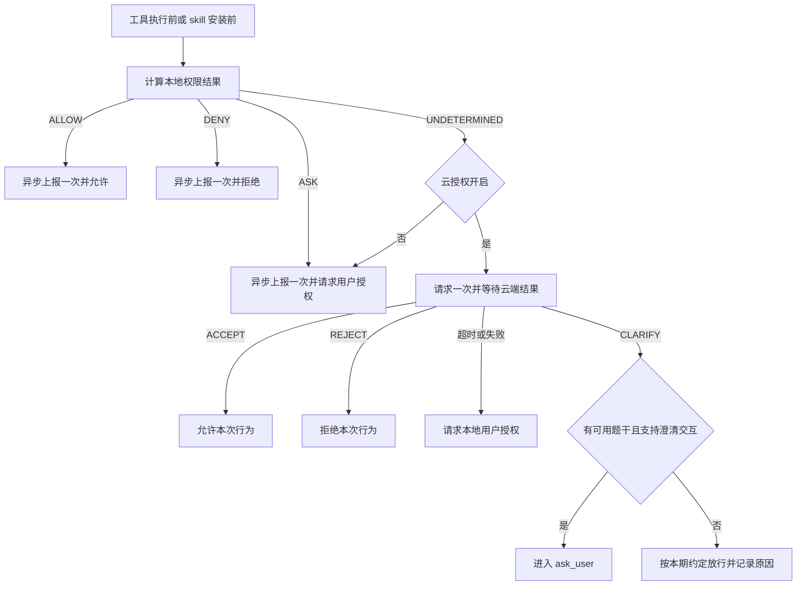

# 小艺 Work 行为上报与云端授权需求

> 本文汇总本次需求沟通中已确认的业务规则，供后续编码和验收使用。文档不是已实现能力说明。最新确认：skill 安装的 `textSource` 使用 **`toolSkill`**。

## 1. 文档状态与代码基线

| 项目 | 内容 |
| --- | --- |
| 更新日期 | 2026-09-21 |
| 需求状态 | 主流程已确认，可开始主体开发；skill 文件描述字段存在遗留项 |
| 本次交付 | 需求文档；未修改业务代码 |
| JiuwenSwarm 分支 | `xiaoyi_0.2.4.beta3` |
| JiuwenSwarm 提交 | `0f9f79817cbeeb4ff103470ce9e00cb8fa9d030d` |
| agent-core 分支 | `br_0.1.16.post2.hotfix` |
| agent-core 提交 | `cffa8b40aae8825b05eb9c04e4c49ebc015b4dea`，与当前 `uv.lock` 一致 |
| claw_desktop 分支 | `jiuwenswarm` |
| claw_desktop 提交 | `47f4366517f496a7cdd97d00177c0a1aaac20093` |
| 验证边界 | 已核对源码与已有测试定义；未完成真实云端、命名管道及界面的端到端联调 |

本文中的“已确认”是业务约束；“建议实现”是编码参考，允许在满足约束的前提下调整；“遗留”不得被当作已确认接口规范。

## 2. 目标与本期范围

本期完成两项能力：

1. 在指定接入点采集工具、参数、执行结果或 skill 信息，上报到小艺 Work 云端。
2. 在工具执行前、skill 安装前，本地无法判定的行为交给云端判定；云端超时或失败时转本地用户授权。

本期接入点固定为以下三个：

| 接入点 | 触发时机 | `textSource` | 行为上报 | 是否可能等待云端授权 |
| --- | --- | --- | --- | --- |
| ④ | Agent 工具执行前 | `toolInput` | 是 | 是，仅本地结果为 `UNDETERMINED` 且云授权开启时 |
| ⑥ | Agent 工具执行后 | `toolOutput` | 是 | 否 |
| ⑦ | skill 安装前 | `toolSkill` | 是 | 是，仅本地结果为 `UNDETERMINED` 且云授权开启时 |

接入点⑦应位于安装内容已经准备好、正式复制或覆盖目标技能目录以及注册生效之前。为获取技能内容而下载到暂存区，不等于安装已经生效。

本期不扩展用户 query、模型 answer 的现有风控业务，也不额外展开自动更新、内置技能初始化、团队专项审批等场景。实现和验收以三个接入点为边界，不据此宣称覆盖所有绕过这些接入点的安装或文件写入方式。

当前桌面部分安装直接写技能目录，未经过框架安装 RPC；只在框架加护栏不能自动覆盖这类旁路。此项作为现状边界记录，不扩大本期范围。

## 3. 已确认的核心规则

### 3.1 本地权限增加“无法判定”状态

现有本地结果为 `ALLOW / DENY / ASK`，新增一个枚举表示无法判定。建议命名：

```python
UNDETERMINED = "undetermined"
```

| 本地结果 | 业务含义 |
| --- | --- |
| `ALLOW` | 本地明确允许当前行为 |
| `DENY` | 本地明确拒绝当前行为 |
| `ASK` | 本地明确要求用户授权当前行为 |
| `UNDETERMINED` | 没有匹配到能覆盖当前行为的专门规则 |

**`default` 是端侧兜底值，不属于本地规则匹配成功。** 在本期接入的判定路径中，没有匹配到专门规则时应返回 `UNDETERMINED`；即使原 `defaults["*"]` 为 `allow`，也不能因此跳过云端判定。

沿用现有规则优先级。明确工具配置、参数规则、有效的既有用户授权等仍属于已覆盖结果；不得因为只检查参数规则而漏掉工具级配置。明确的 `ASK` 已属于本地覆盖，直接进入用户授权，不请求云端替代决策。

实现应保留判定来源，避免把来自 `defaults / fallback` 的结果误认成明确规则命中。合并文件、路径、网络等防护结果时，新状态不得覆盖已经明确的拒绝或人工授权要求。

### 3.2 同一接入点的一次行为只发送一次业务请求

上报和云端授权使用同一云接口。区别是当前执行流程是否等待该次请求的返回结果。

| 场景 | 云请求 | 当前行为如何继续 |
| --- | --- | --- |
| 工具执行前或安装前，本地 `ALLOW` | 异步上报一次 | 按本地结果允许 |
| 工具执行前或安装前，本地 `DENY` | 异步上报一次 | 按本地结果拒绝 |
| 工具执行前或安装前，本地 `ASK` | 异步上报一次 | 直接请求本地用户授权 |
| 工具执行前或安装前，本地 `UNDETERMINED`，云授权开启 | 发送一次并等待结果；这次调用同时承担上报和云端判定 | 依据云端结果处理 |
| 工具执行前或安装前，本地 `UNDETERMINED`，云授权关闭 | 异步上报一次 | 转本地 `ASK`，请求用户授权 |
| 工具执行后 | 异步上报一次 | 不等待云端 |

约束：

- 同一事件不能先异步上报一次，随后为了授权再重复发送同一份请求。
- 本地 `ASK` 的“不上云”特指不等待云端授权；行为数据仍然异步上报。
- 工具输入与工具输出是两个不同事件，各自上报一次，不属于重复请求。
- Agent 调用安装工具时，接入点④与⑦也是两个不同事件；须分别标识，避免同一接入点内部重复触发。
- 技术上可以统一使用异步 HTTP 客户端；“同步等待”指当前行为必须等待结果，不要求阻塞整个 AgentServer 线程。

### 3.3 云授权开关与端侧兜底

在 `config.yaml` 增加独立的云端行为授权开关。建议配置结构如下，具体名称可在编码时按仓库规范调整：

```yaml
xiaoyi_work_security:
  cloud_authorization:
    enabled: false
    timeout_ms: 3000
```

`3000` 是建议初值，不是需求方确认的 SLA；实现时保留可配置性，并在联调时验证。

- 开关关闭：不等待云端授权；已覆盖的行为按本地规则处理，`UNDETERMINED` 转本地用户授权。
- 开关开启：只有 `UNDETERMINED` 等待云端判定。
- 关闭云授权不关闭异步行为上报。
- 该开关不能复用 `permissions.enabled`；关闭云授权不能顺带关闭本地用户授权。
- **`UNDETERMINED + 云授权关闭` 明确转 `ASK`，不重新取 `default: allow` 放行。** 它与明确规则产生的 `ASK` 可以复用同一用户授权流程，但必须保留不同判定来源。



## 4. 云端响应与 CLARIFY 处理

### 4.1 复用现有返回结构

需求方已确认各接口返回字段和语义一致，复用当前文本风控接口的外层解析：

```json
{
  "retCode": "0",
  "retMsg": "success",
  "data": {
    "securityResult": "ACCEPT"
  }
}
```

`retCode` 表示接口调用是否成功，`data.securityResult` 表示业务判定。HTTP 成功或 `retCode` 成功不能单独当作授权成功。实现应兼容现有正常返回类型，缺失或无法识别的决策属于无法获得有效判定。

以下表格只用于**需要等待云端决策**的分支：

| 结果 | 处理 |
| --- | --- |
| `ACCEPT` | 允许本次行为，不自动扩大或持久化为整工具授权 |
| `REJECT` | 拒绝当前行为，使用返回提示信息反馈；不当作接口故障转人工放行 |
| `CLARIFY` | 按 4.2 处理 |
| 超时、网络错误、管道不可用、鉴权失败、业务错误、无有效判定 | 转本地用户授权，不直接放行 |

异步上报分支不使用迟到的响应反转本地决定，也不因上报失败阻塞、重执行或撤销已经处理的行为。

### 4.2 CLARIFY 的本期策略

`CLARIFY` 表示疑似风险，需要用户进一步澄清。需求方已给出本期降级规则：**能走现有 `ask_user` 则走；无法走通则放行。**

当前代码核对结论：

1. 框架有 `StructuredAskUserRail`，桌面有问题展示和答案通过 `chat.send` 回传的机制。
2. `StructuredAskUserRail` 要求非空的 `questions[].question`，或非空的普通 `query`；缺失题干会返回参数错误。
3. 桌面 `parseAskUserQuestions()` 过滤空问题；问题列表为空时不展示提问卡片。
4. 当前风控处理没有把 `CLARIFY` 自动转成上述问题结构的逻辑。原始工具参数不能自动充当澄清题干。
5. 当前 query/answer 风控将 `CLARIFY` 按放行处理，这是既有实现现状，不代表已经具备澄清交互。

本期新增处理规则：

- 能取得可用的澄清问题，并能建立问题与当前待执行行为的关联、展示及回答回传时，进入 `ask_user`。
- 只有 `CLARIFY` 状态，没有可用题干，或当前入口不支持该交互时，按本期约定放行，记录降级原因。
- `remind / lastingRemind` 是已有提示文案字段；非空提示不一定构成可回答的澄清问题。不得将通用拒绝话术直接当作问题，也不假设已存在专用问题字段。
- 用户补充文字不等于授权允许。接通澄清分支时，应把补充内容交回当前行为判断流程，不能把任意答案转换为 `approved=True`。
- 用户取消或停止任务不能被当成“链路不支持”而继续执行原行为；不得以此触发放行降级。
- CLARIFY 的特殊降级不得扩展到云端超时、失败或明确 `REJECT`。

此前沟通中提及的 `clarification=0/1/2/3`，当前相关代码尚无字段适配。其请求/响应位置、授权范围及回传协议不作为本期主体开发前置条件；本期不新增该数字协议，不将 `2` 擅自映射为永久授权。后续扩展按真实接口定义补齐。

## 5. 云接口与主进程分工

### 5.1 接口标识

```http
POST /celia-claw/v1/rest-api/skill/execute
x-skill-id: moderation-text
Content-Type: application/json
```

`skill/execute` 是云端能力调用入口；`moderation-text` 指定风控能力。它不表示要在本机安装一个同名 skill，也不限定只审核 skill 安装。

本期固定值：

| 项 | 取值 |
| --- | --- |
| 云端能力请求头 `x-skill-id` | `moderation-text` |
| `businessId` | `WINPC_XIAOYI_WORK`，请求体与已有业务头采用一致值 |
| 小艺标识字段名 | `isXiaoyiAPP` |
| 行为 `action` | `tool`，skill 安装也使用该值 |
| 工具输入 `textSource` | `toolInput` |
| 工具输出 `textSource` | `toolOutput` |
| skill 安装 `textSource` | `toolSkill` |

当前 query/answer 客户端默认能力 ID 为 `skill-scope`，不能直接复制为本期值。旧需求样例中的安装类型 `skillInstall` 已被 **`toolSkill`** 替代；本期新请求、类型、测试及日志分类须同步采用新值。是否保留其他业务旧类型，不在本期强制删除范围内。

### 5.2 命名管道与鉴权

建议复用当前链路：

```text
JiuwenSwarm 采集事件并选择是否等待
    → HTTP over Windows 命名管道（np://claw-skill）
    → 小艺 Work 主进程 SkillApiProxy
    → 主进程补齐云端鉴权、设备身份及必要业务上下文
    → 云端 skill/execute
```

- 所有云端鉴权字段由小艺 Work 主进程装配，不在框架中保存或重新实现云端业务凭据签发。
- 复用主进程管理的 `businessCredential / x-uid / x-device-id` 等头及刷新逻辑。
- 框架访问本机管道所需的临时令牌与云端凭据不同；沿用当前 `CLAW_SKILL_TOKEN` 传递方式，本机令牌不得作为云端凭据转发。
- `x-skill-id`、请求关联 ID 等业务字段与鉴权字段分开处理。
- 现有代理不会自动构造完整风控 body。设备、用户、包名等真实上下文由主进程提供或补全；不得从手机示例硬编码。
- session、轮次、工具调用 ID、事件阶段和重试关联信息应保留，不混用不同会话的上下文。

## 6. 请求数据格式

### 6.1 公共字段

| 字段 | 类型及规则 |
| --- | --- |
| `action` | 字符串，`tool`，只出现一次 |
| `businessId` | 字符串，`WINPC_XIAOYI_WORK` |
| `sessionID` | 当前行为所属会话 ID，注意字段大小写 |
| `seqNo` | 与当前用户对话轮次关联；不让每个工具自行从 1 计数，不与工具 `index` 混用 |
| `questionText` | 按接入点区分，见 6.2—6.4 |
| `answerText` | 按本次样例为空字符串 |
| `language` | 按当前会话/应用语言提供，原样例为 `zh-CN` |
| `textSource` | `toolInput / toolOutput / toolSkill` |
| `textStatus` | 这三个接入点按原样例使用 `complete` |
| `extra` | JSON 字符串，包含真实设备、用户、包名、时间等上下文；不是嵌套对象 |
| `dialogueContext` | 原样例中的对话上下文数组，取当前会话真实内容；安装若无关联对话，不编造历史 |
| `isXiaoyiAPP` | 布尔字段；字段名已确认，值沿相应业务样例/宿主上下文提供，不把手机示例视为所有端的恒定值 |
| `enableExperiencePlan / countryCode` | 沿实际宿主上下文与原样例装配，不在框架伪造用户偏好或地域 |
| `isFinalEqualsLastText` | 原工具输出样例中的字段，按接口现有适用方式提供 |

以下 JSON 用于说明类型和结构，示例 ID、路径和内容不代表真实用户数据，也不是云端实测记录。公共上下文均需由运行时补齐。

### 6.2 工具输入：questionText 为 JSON 字符串

```json
{
  "action": "tool",
  "businessId": "WINPC_XIAOYI_WORK",
  "sessionID": "11111111-1111-4111-8111-111111111111",
  "seqNo": 1,
  "questionText": "{\"function\":{\"name\":\"write_file\",\"arguments\":\"{\\\"path\\\":\\\"notes.txt\\\",\\\"content\\\":\\\"hello\\\"}\"},\"index\":0,\"id\":\"call-example-1\",\"type\":\"function\"}",
  "answerText": "",
  "language": "zh-CN",
  "textSource": "toolInput",
  "textStatus": "complete"
}
```

`function.arguments` 按原样例也是 JSON 字符串。由真实工具调用序列化构造，不手工拼接引号；工具名、调用 ID、参数按原始调用保留。

### 6.3 工具输出：questionText 为 JSON 字符串

```json
{
  "action": "tool",
  "businessId": "WINPC_XIAOYI_WORK",
  "sessionID": "11111111-1111-4111-8111-111111111111",
  "seqNo": 1,
  "questionText": "{\"funcName\":\"write_file\",\"toolCallId\":\"call-example-1\",\"payload\":{\"result\":\"ok\"}}",
  "answerText": "",
  "language": "zh-CN",
  "textSource": "toolOutput",
  "textStatus": "complete",
  "isFinalEqualsLastText": false
}
```

示例 `payload` 仅用于展示封装层，实际放入真实工具结果。不同工具不应伪造手机工具特有的 `namespace / intentName / actionResponse` 等内容。失败结果应反映真实失败，不伪造成功。

### 6.4 skill 安装：questionText 为对象，textSource 为 toolSkill

```json
{
  "action": "tool",
  "businessId": "WINPC_XIAOYI_WORK",
  "sessionID": "11111111-1111-4111-8111-111111111111",
  "seqNo": 1,
  "questionText": {
    "function": {
      "name": "install_skill",
      "arguments": "{\"identifier\":\"example-skill\",\"source\":\"skillnet\"}"
    },
    "index": 0,
    "id": "call-example-2",
    "type": "function",
    "file": [
      {
        "type": "doc",
        "url": "https://example.invalid/obs/example-skill",
        "hash": "__TODO_HASH__",
        "size": "__TODO_SIZE__",
        "body": "__TODO_BODY__",
        "fromType": "download"
      }
    ]
  },
  "answerText": "",
  "language": "zh-CN",
  "textSource": "toolSkill",
  "textStatus": "complete"
}
```

- `file` 位于 `questionText` 内，保留原样例结构。
- `type` 默认 `doc`；`fromType` 为原需求给出的 `upload / download / create`，按真实来源填写。
- `function` 等调用信息按真实安装上下文构造，不能把示例工具参数视为所有安装入口的固定参数。
- `__TODO_*__` 和 `example.invalid` 仅是文档占位符，禁止直接发送到线上接口。占位符不代表字段已确定为字符串或可任意省略。
- `hash / size / body` 以及上传对象的口径见第 10 节；因此该示例不构成可直接通过云端校验的完整安装请求。

## 7. skill 文件 URL 与安装时序

参考 `send_file_to_user` 相关文件处理路径，复用底层上传能力获取云端可访问 URL，而不是调用整个用户文件投递工具。

当前可复用 `upload_local_file_public_url()`，其流程为：

```text
prepare → 按返回的上传信息传文件 → completeAndQuery → fileDetailInfo.url
```

该函数已有命名管道控制请求支持；预签名上传 URL 的数据传输沿用既有上传机制。云鉴权仍由主进程补齐。

注意：`send_file_to_user` 的部分 `download_url` 为本机 `/file-api/download?token=...`，不能直接作为云端风控可访问 URL。整个工具还会发文件卡片、写历史、去重投递，这些副作用不属于本次风控上传。

建议安装时序：

1. 获取并暂存待安装内容，保留来源与安装行为关联信息。
2. 得到可上传文件和文件描述；上传对象未定部分保留独立适配点。
3. 接入点⑦执行本地判定，选择异步上报或一次等待式云请求。
4. 仅在行为被允许后正式安装；被拒绝或等待用户时不得先覆盖原技能目录、注册或启用新技能。

需要云端决策时，文件上传与判定共同处于当前行为的等待范围；上传失败导致无法完成云判定时，进入本地用户授权。纯异步上报路径应由后台任务负责所需上传和发送，不能因云上传而变成等待式授权。

暂存内容应保持稳定，避免异步任务读取文件前被安装清理删除，也避免审核内容与最终安装内容发生变化。

上传协议已有的 `fileSha256 / fileSize` 定义只证明上传接口的算法和单位，不自动等价于风控 `file.hash / file.size` 的定义。

## 8. 建议实现与现有代码限制

### 8.1 agent-core：权限状态与扩展点

- 在 `PermissionLevel` 中加入新状态，调整未命中规则时的返回及判定来源保留。
- 核查 `strictest`、权限排序表、属性判断、规则合并、序列化及所有消费者。新状态不能落入原来默认作为 `ASK` 处理的分支，也不能因排序表缺项报错。
- 在 PermissionRail 的结果处理阶段区分 `ASK` 与 `UNDETERMINED`；明确 ASK 直接走用户确认，只有 UNDETERMINED 才交给宿主云判定。
- 云端判定细节由 JiuwenSwarm 宿主实现，agent-core 不内置小艺 Work 域名、凭据或业务 payload。
- 对未启用本期接入的宿主保留兼容行为。新枚举不能在其他产品中造成未处理状态或改变既有 default 语义。
- 同步更新 JiuwenSwarm 实际依赖的 agent-core 版本或开发依赖；只改旁边的源码目录不代表运行环境已加载修改。

### 8.2 JiuwenSwarm：统一事件与流程协调

建议复用 `BaseSecurityRail` 的工具前后回调、`PermissionInterruptRail` 的本地权限与中断机制。新增的业务协调层统一负责：

- 构造不可变行为事件快照，保留 session、轮次、工具调用 ID 和接入点。
- 先确定本地结果，再选择异步上报或等待式请求，确保一次业务请求。
- 通过管道客户端发送请求，解析云端结果，并连接本地授权或 CLARIFY 分支。
- 在 SkillManager 的安装生效前复用同一行为授权服务；只有工具 Rail 不足以证明安装前检查已经覆盖。
- 排除对风控上报、上传内部调用的递归采集，避免上报请求再次触发上报。

若使用独立上报 Rail，必须与权限协调层共享一次行为的请求状态，不能在工具前回调先发送一份，再在权限回调中发送第二份。

当前旧 `CsplSentinelRail` 会等待扫描结果，使用旧格式和失败放行策略。本期需在目标接入场景中协调其启用关系，避免与新逻辑重复上报、重复拦截。不得直接把旧 CSPL 的“失败允许”用于新云授权。

### 8.3 用户交互与权限开关

当前部分 channel 的确认回调存在自动批准行为，团队另有 Leader 审批路径。目标接入点的“本地用户授权”必须实际到达用户交互，不能因旧回调自动批准而声称兜底已实现。

`ToolPermissionHost.request_permission_confirmation` 返回 `"interrupt"` 才会转内置确认；返回 `None` 的现有语义是确认失败并拒绝，不是弹用户授权。接入时必须按真实契约处理。

对 skill 安装 RPC，不能直接假设抛出 Agent 工具中断就会展示卡片；仅在存在对应会话和恢复路径时复用交互，其他入口不冒充已经完成端到端覆盖。

### 8.4 异步任务与请求关联

建议采用受管理的后台任务或有界队列，显式处理异常、任务生命周期、退出清理与队列满情况。不得在上报分支等待云响应，也不得静默吞掉后台任务失败。

同一工具的输入和输出必须可关联；权限中断恢复不能重复发送同一接入点的事件。工具被拒绝、执行失败、重试、取消时，应区分真实执行结果和合成提示，不把未执行行为记为执行成功。

“全流程”在本期指三个接入点的数据采集范围，不自行承诺断电不丢、无限重试或严格 exactly-once。传输重试是同一逻辑请求的重试，应保留关联信息；不借重试机制新增第二次独立授权流程。

## 9. 源码索引与当前差异

以下路径相对于各自仓库根目录，按第 1 节提交核对；编码前如版本变化，需重新确认对应实现。

| 仓库 | 文件或符号 | 用途或注意事项 |
| --- | --- | --- |
| JiuwenSwarm | `jiuwenswarm/resources/config.yaml`，`permissions.defaults` | 当前模板 `"*": "allow"`，本期不能当作明确规则命中 |
| agent-core | `openjiuwen/harness/security/permission_engine/models.py`，`PermissionLevel` | 当前只有 ALLOW / ASK / DENY |
| agent-core | `openjiuwen/harness/security/permission_engine/toolguard/tool_policy.py`，`_evaluate_single_invocation / evaluate_tiered_policy` | 规则匹配、工具基线、defaults 与 fallback |
| agent-core | `openjiuwen/harness/security/permission_engine/core.py`，`check_permission` | 工具规则与路径、网络防护结果合并 |
| agent-core | `openjiuwen/harness/rails/security/base_security_rail.py` | 工具执行前后安全回调扩展点 |
| agent-core | `openjiuwen/harness/rails/security/tool_security_rail.py`，`PermissionInterruptRail` | 本地权限结果及确认处理 |
| agent-core | `openjiuwen/harness/security/permission_engine/host.py` | 宿主权限扩展协议 |
| JiuwenSwarm | `jiuwenswarm/agents/harness/common/rails/interrupt/interrupt_helpers.py`，`build_permission_rail` | Host 装配、渠道确认分支、前端交互转换 |
| JiuwenSwarm | `jiuwenswarm/agents/harness/common/rails/ask_user_rail.py`，`StructuredAskUserRail.resolve_interrupt` | 空题干被拒绝，有效问题与回答处理 |
| JiuwenSwarm | `jiuwenswarm/agents/harness/common/rails/cspl/sentinel_rail.py` | 旧工具风控流程，需要避免重复挂载产生双重请求 |
| JiuwenSwarm | `jiuwenswarm/common/np_transport.py`，`named_pipe_transport_for` | HTTP over 命名管道客户端 |
| JiuwenSwarm | `jiuwenswarm/agents/harness/common/tools/skill_toolkits.py` | Agent 安装工具到 SkillManager 的调用路径 |
| JiuwenSwarm | `jiuwenswarm/server/runtime/skill/skill_manager.py` | 安装、导入、复制和注册路径 |
| JiuwenSwarm | `jiuwenswarm/agents/harness/common/tools/send_file_to_user.py` | 文件投递链路参考，不能直接作为无副作用上传函数使用 |
| JiuwenSwarm | `jiuwenswarm/agents/harness/common/tools/web_file_download.py` | 本机下载 URL，不是 OBS 公网 URL |
| JiuwenSwarm | `jiuwenswarm/agents/harness/common/tools/xiaoyi_phone_tools/file_upload_helpers.py` | prepare / 上传 / completeAndQuery，返回公网 URL |
| claw_desktop | `src/main/services/skill-api-proxy.ts`，`SkillApiProxy` | `np://claw-skill` 代理、鉴权头注入 |
| claw_desktop | `src/main/services/file-upload-proxy.ts` | 上传控制面代理与主进程鉴权 |
| claw_desktop | `src/core/risk-control/risk-control-client.ts` | 现有风控 HTTP 解析、公共字段与业务头参考 |
| claw_desktop | `src/core/risk-control/types.ts` | 响应类型；如复用请求类型需补 `toolSkill` |
| claw_desktop | `src/main/services/risk-control-service.ts` | 当前 CLARIFY 和接口失败均可放行，不能照搬为本期授权处理 |
| claw_desktop | `src/core/framework/jiuwenswarm/jiuwenswarm-framework.ts` | ask_user 展示、空问题过滤、答案回传 |

既有文档《工具权限与安全防护》用于理解旧机制，其中部分路径可能早于当前代码迁移；本期新规则以本文及上述实际源码为准，不修改旧文档来冒充新能力已实现。

## 10. 遗留项与不阻塞主体开发的处理方式

| 编号 | 遗留内容 | 本期处理边界 |
| --- | --- | --- |
| F-01 | `file.hash` 的算法与计算对象：安装包、SKILL.md 或其他内容 | 独立封装描述构造，不擅自选定，不使用示例占位值发云端 |
| F-02 | `file.size` 的单位、计算对象及最终类型 | 与 F-01 一起确认；不从上传接口的字节数直接推定 |
| F-03 | `file.body` 是否只含 SKILL.md，是否包含其他文件内容，以及大小限制 | 保留适配点，不把正文范围视为已定 |
| F-04 | 上传取得 URL 的对象与 F-01—F-03 如何对应 | 上传机制已明确；上传哪个文件与文件描述口径一并补齐 |

上述遗留项不阻塞枚举、路由、管道客户端、工具输入输出接入和安装前检查骨架的开发，但**在遗留字段补齐或接口方确认可省略前，不能宣称完整 skill 安装上报已通过云端验收**。不得默认假设字段可省略、随意填空或生成看似真实的 hash。

CLARIFY 的无题干场景已有明确降级策略，不再作为开工阻塞项；后续若需要完整的数字 clarification 协议，再单独定义。

## 11. 验收清单

| 编号 | 场景 | 预期 |
| --- | --- | --- |
| P-01 | 明确 ALLOW，云响应迟到或失败 | 异步上报一次；本地允许行为不等待云端 |
| P-02 | 明确 DENY | 异步上报一次；工具或安装不执行，不申请云端覆盖 |
| P-03 | 明确 ASK，云授权开启或关闭 | 均直接请求用户授权；异步上报一次 |
| P-04 | 无专门规则，原 defaults 为 allow | 返回 UNDETERMINED；不能静默按默认 allow 执行 |
| P-05 | UNDETERMINED，云授权开启，返回 ACCEPT | 等待期间不执行；允许后执行；该接入点只有一次业务请求 |
| P-06 | UNDETERMINED，云授权开启，返回 REJECT | 拒绝，不转人工当作接口故障处理 |
| P-07 | 云端超时、异常、无有效判定、管道不可用 | 转本地用户授权；不能套用 CLARIFY 的放行策略 |
| P-08 | UNDETERMINED，云授权关闭 | 异步上报并转 ASK；即使原 defaults 为 allow，也不直接放行 |
| P-09 | CLARIFY 有可用题干且交互支持 | 暂停并展示问题；回答可关联回原行为，不把任意补充视为允许 |
| P-10 | CLARIFY 无题干或入口不支持交互 | 按约定放行并记录原因，不创建空问题卡片 |
| P-11 | 澄清或授权期间用户取消任务 | 不执行原行为，不因取消触发放行降级 |
| P-12 | 工具执行后，云上报缓慢或失败 | 使用 toolOutput 异步上报，不阻塞后续处理 |
| P-13 | skill 安装前 | 使用 toolSkill；允许前不覆盖、注册或启用待安装技能 |
| P-14 | 请求字段校验 | businessId、isXiaoyiAPP、action 与 questionText 类型符合本文件 |
| P-15 | skill 文件 URL | 复用上传机制取得云端可访问 URL，无额外用户文件卡片或本机相对 URL 混入 |
| P-16 | 中断恢复、并发工具及多会话 | 上下文不串用，同一接入点不重复请求；输入和输出可关联 |
| P-17 | 既有用户授权、文件或网络明确规则 | 保留原有优先级；新状态不会覆盖明确 ASK / DENY |
| P-18 | 其他未接入本需求的宿主 | 既有权限行为兼容，新枚举不会引发未处理分支或排序异常 |
| P-19 | 新旧 CSPL 同时存在 | 目标行为不会被两套逻辑重复请求或产生冲突决策 |
| P-20 | 文件描述遗留项尚未定稿 | 不发送占位符；验收报告明确 skill 完整云端联调的未完成部分 |

建议验证顺序：权限状态及流程单测 → payload 和管道代理测试 → 三个接入点集成测试 → 用户授权/CLARIFY 交互验证 → 补齐文件字段后真实云端联调。记录实际跑过的验证，不以源码审阅代替端到端结果。

## 12. 本次确认记录

- default 不算明确规则命中；新增无法判定枚举，只有该状态进入等待式云端授权。
- 明确 ASK 只走本地用户授权，仍异步上报行为。
- 一次接入事件只发送一次业务请求；等待式请求同时完成上报与判定。
- 云授权关闭时，无法判定转本地 ASK，不沿用 default: allow 放行。
- 本期只考虑工具执行前、工具执行后、skill 安装前三个接入点。
- CLARIFY 能接入 ask_user 时接入；无题干或不支持时按本期约定放行。
- businessId 为 WINPC_XIAOYI_WORK；小艺标识字段名为 isXiaoyiAPP；安装 action 为 tool。
- questionText 沿原样例类型：工具输入输出为字符串，skill 安装为对象。
- 文件 URL 复用现有上传机制；hash、size、body 的口径明确列为遗留。
- **最新通知：skill 安装 textSource 从 skillInstall 改为 toolSkill。**
